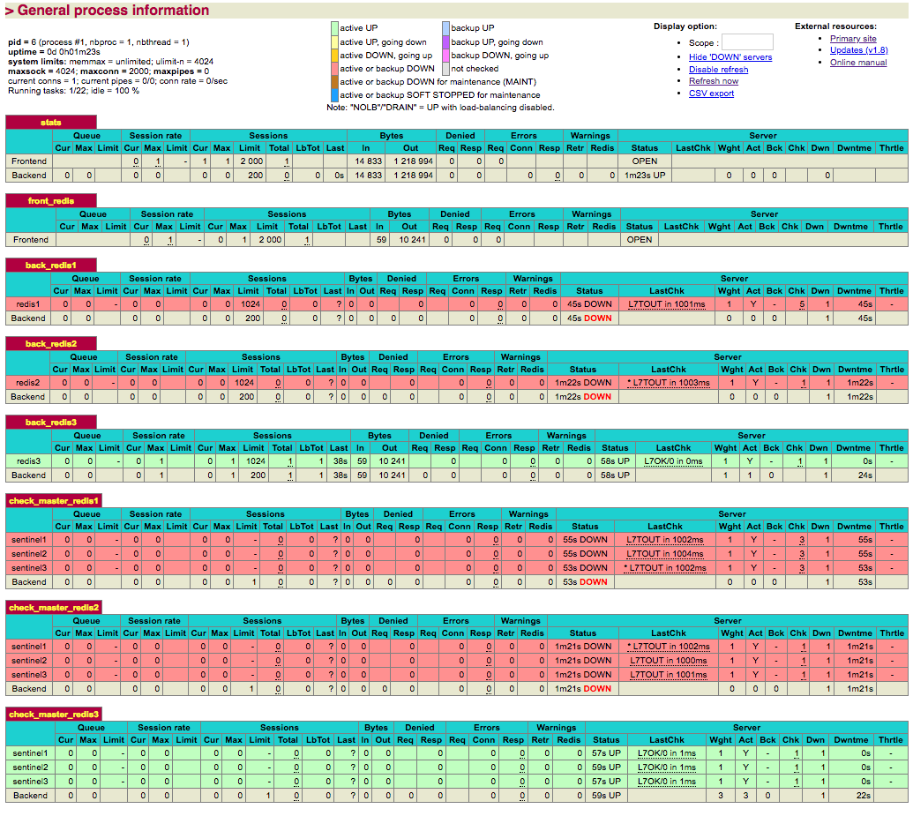

# RedisClusterSampleOnDocker
A sample setup of a Redis cluster behind a single HAProxy, with automatic failover on Docker.
Failover is based on consensus from at least 2 sentinel nodes about which node is the current master, to prevent split brain scenarios.

## Instructions
* Clone repository
* Run `docker-compose up -d --build`
* Connect to redis on localhost port 6379 to read/write from the master
* Connect on HAProxy status page on http://localhost:8080

## Credits and sources
* https://www.haproxy.com/blog/haproxy-advanced-redis-health-check/
* http://cbonte.github.io/haproxy-dconv/1.8/configuration.html#tcp-check%20expect
* https://redis.io/topics/sentinel

## Screenshot of HAProxy status

